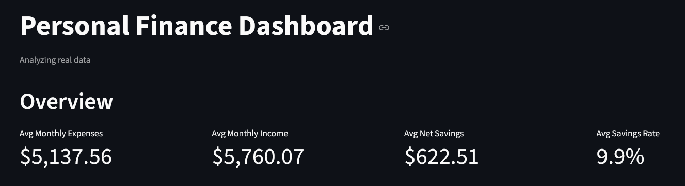
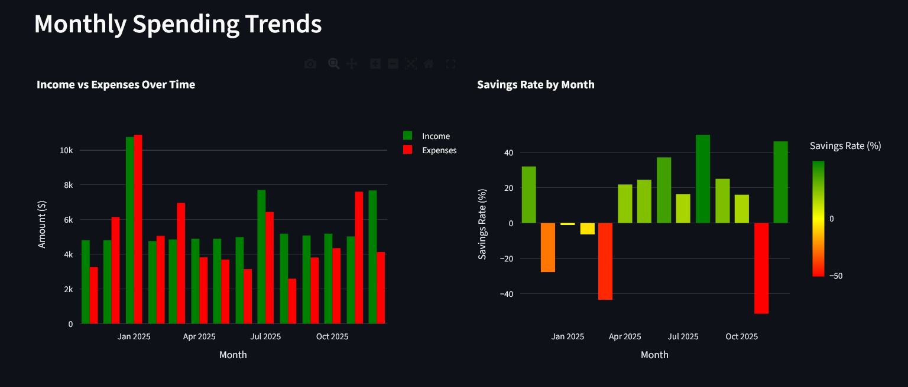
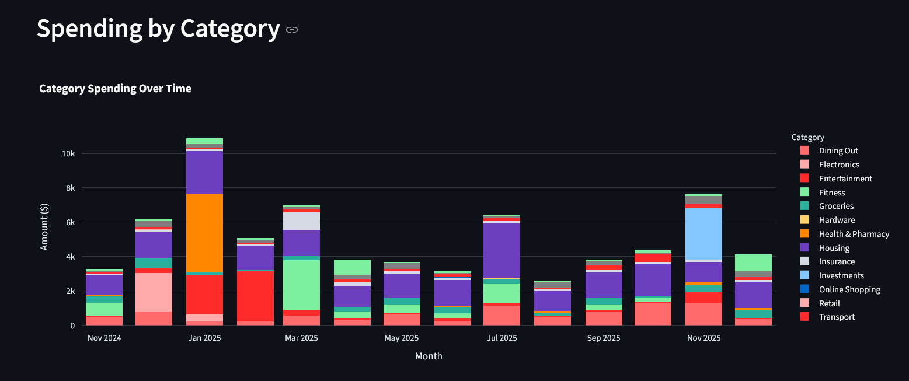
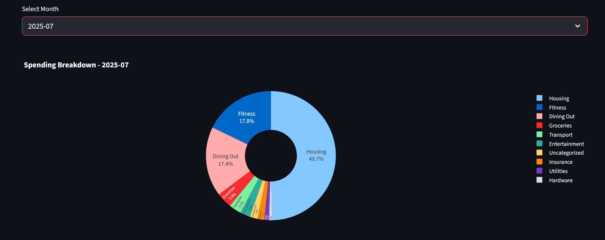
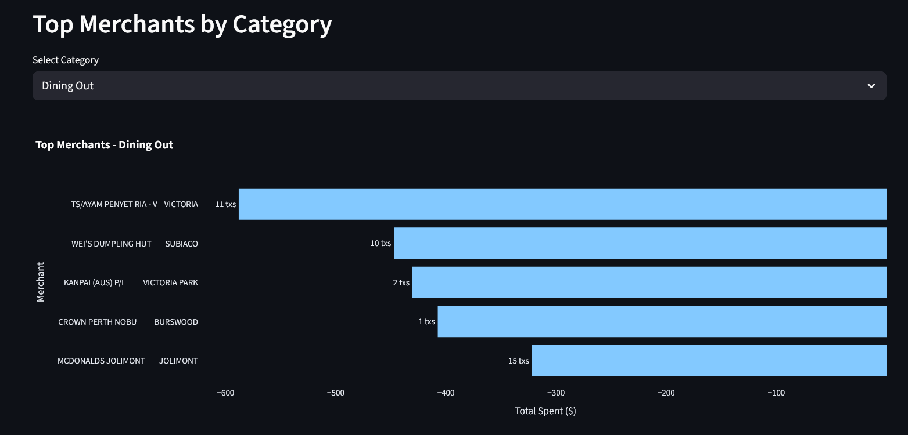
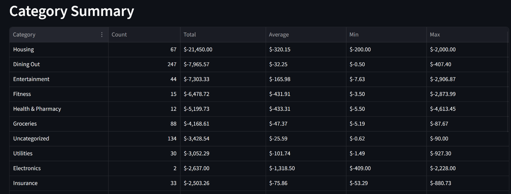

# Personal Finance Tracker

A Python-based ETL pipeline for tracking and categorizing personal spending across multiple bank accounts, with an interactive Streamlit dashboard for visualization and analysis.

See NOTES.md for my detailed learning notes and thought process throughout this project.

## Features

- **Multi-bank ETL pipeline** - Load and normalize transaction data from multiple bank CSV formats
- **Automated categorization** - Pattern-matching rules engine for transaction classification
- **SQLite storage** - Structured data storage with optimized queries for analysis
- **Interactive dashboard** - Streamlit app with spending breakdowns, trends, and merchant insights
- **Privacy-first design** - Real data stays local; synthetic data generator for demos

## Screenshots













## Tech Stack

| Component | Technology |
|-----------|------------|
| Data Processing | Python, pandas |
| Database | SQLite |
| Dashboard | Streamlit, Plotly |
| Dependency Management | UV |

## Setup Instructions

```bash
# Clone the repository
git clone https://github.com/yourusername/personal-finance.git
cd personal-finance

# Install UV (if not already installed)
pip install uv

# Install dependencies
uv sync

# Generate synthetic data for demo
uv run python scripts/generate_synthetic_data.py

# Run the ETL pipeline
uv run python scripts/run_pipeline.py synthetic

# Launch the dashboard
uv run streamlit run app.py
```

**Note:** If you're using different banks, you'll need to adapt the load scripts (`01_load_bank_a.py`, `02_load_bank_b.py`) to match your bank's CSV format and column structure.

## Project Structure

```
personal-finance/
├── data/
│   ├── raw/
│   │   ├── real/              # Your bank CSVs (gitignored)
│   │   └── synthetic/         # Generated demo data
│   ├── processed/
│   │   ├── real/              # Processed real data (gitignored)
│   │   └── synthetic/         # Processed synthetic data
│   └── category_rules.csv     # Pattern matching rules
├── scripts/
│   ├── 01_load_bank_a.py      # Load and normalize Bank A data
│   ├── 02_load_bank_b.py      # Load and normalize Bank B data
│   ├── 03_combine.py          # Merge all bank data
│   ├── 04_categorize.py       # Apply category rules
│   ├── 05_load_to_db.py       # Load to SQLite
│   ├── 06_analyze.py          # SQL analysis queries
│   ├── generate_synthetic_data.py
│   └── run_pipeline.py        # Pipeline orchestrator
├── screenshots/               # Dashboard screenshots
├── app.py                     # Streamlit dashboard
└── pyproject.toml             # UV project config
```

## Data Privacy

- All real financial data is excluded via `.gitignore`
- Synthetic data generator creates realistic fake transactions for demos
- Safe to push to public repositories

## Key Learnings

This project was an exercise in balancing learning with leveraging AI tools effectively. Some key takeaways:

**Technical:**
- Pandas for data cleaning and transformation across different CSV formats
- SQLite for structured storage and SQL-based analysis
- Python module patterns (`if __name__ == "__main__"`) for pipeline orchestration
- Streamlit for rapid dashboard prototyping

**Process:**
- Pattern matching order matters - more specific rules (like transfers) need precedence over general ones (like transport)
- Always validate synthetic data generators - they can inadvertently include real info
- UV simplifies Python dependency management, especially in AI-assisted workflows

**AI-Assisted Development:**
- Effective prompting requires domain knowledge to catch errors (e.g., income figures that seemed too high revealed a categorization bug)
- Garbage in, garbage out - referencing official documentation improves AI suggestions significantly
- The right balance: use AI to handle syntax and boilerplate, focus human effort on architecture and validation

See [NOTES.md](NOTES.md) for detailed learning notes and thought process throughout this project.

##Next Steps: 
- Host streamlit app on cloud. 